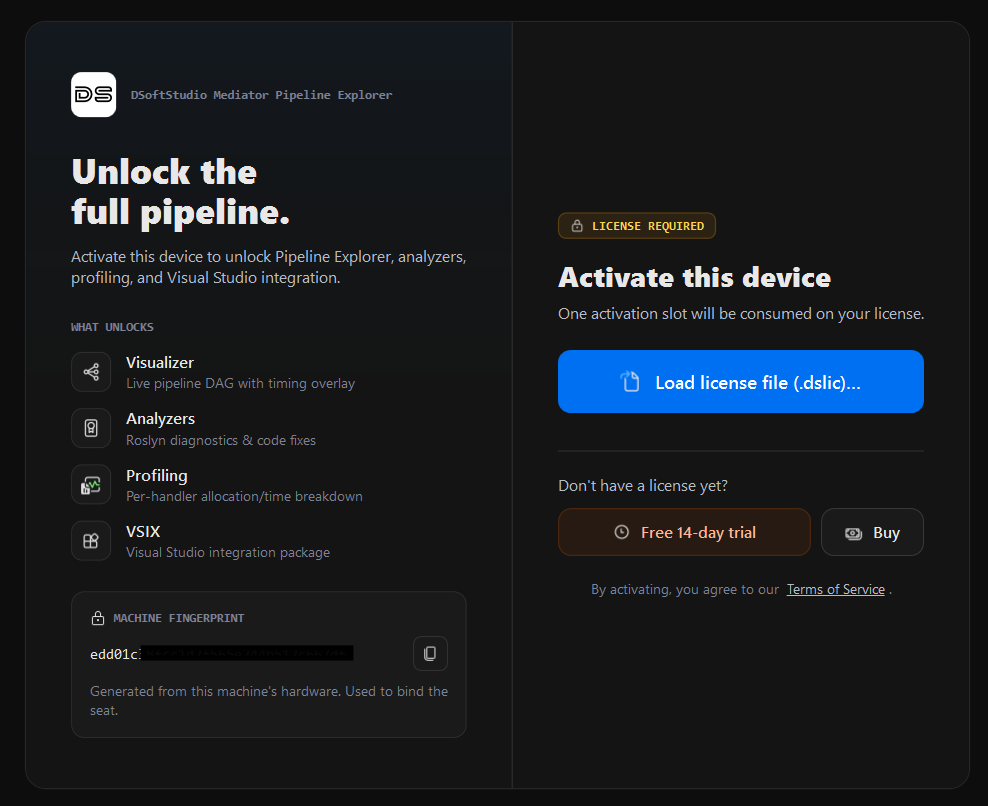

<p align="center">
  <picture>
    <source media="(prefers-color-scheme: dark)" srcset="https://raw.githubusercontent.com/DSoftStudio/Mediator/main/assets/images/DSoftStudioBgWhite.svg">
    <source media="(prefers-color-scheme: light)" srcset="https://raw.githubusercontent.com/DSoftStudio/Mediator/main/assets/images/DSoftStudio.svg">
    
  </picture>
</p>

[← Back to Pipeline Explorer](../index.md)

# Installation

Pipeline Explorer ships as two editions — one for Visual Studio Code and one for Visual Studio. Pick the edition that matches your IDE and follow the steps below.

A single license activates both editions, so installing one does not prevent installing the other on the same machine.

---

## Visual Studio Code

### Requirements

- Visual Studio Code 1.85 or newer
- .NET 8 or .NET 10 in the target solution
- A project that references `DSoftStudio.Mediator`
- Windows, macOS, or Linux

### Install from the Marketplace

1. Open Visual Studio Code.
2. Open the Extensions view (`Ctrl+Shift+X` on Windows / Linux, `Cmd+Shift+X` on macOS).
3. Search for **DSoftStudio Mediator**.
4. Click **Install** on the entry published by **DSoftStudio**.

Or install from the command line:

```shell
code --install-extension DSoftStudio.dsoftstudio-mediator
```

### Install from a `.vsix` file

If your environment can't reach the Marketplace, download the latest release from the [GitHub releases page](https://github.com/DSoftStudio/Mediator.Enterprise/releases) and install:

```shell
code --install-extension dsoftstudio-mediator-<version>.vsix
```

### First launch

- A new **Mediator Pipelines** view appears in the Activity Bar.
- The bundled server starts automatically when you open a workspace containing a `.sln` file.
- No manual server installation is required.

### Verify the install

1. Open a folder that contains a `.sln` file referencing `DSoftStudio.Mediator`.
2. Click the **Mediator Pipelines** icon in the Activity Bar.
3. The tree populates with **Request Pipelines**, **Notifications**, and **Streams** sections.

If the tree is empty, click the **Refresh** button in the view's toolbar. See [Troubleshooting: empty tree](../troubleshooting/empty-tree.md) if the issue persists.

---

## Visual Studio

### Requirements

- Visual Studio 2022 17.0+ or Visual Studio 2026 (Community, Professional, or Enterprise)
- .NET Framework 4.8 runtime (bundled with Visual Studio)
- .NET 8 or .NET 10 in the target solution
- A project that references `DSoftStudio.Mediator`

### Install from the Marketplace

1. In Visual Studio, open **Extensions → Manage Extensions**.
2. Switch to the **Online** tab.
3. Search for **DSoftStudio Mediator Pipeline Explorer**.
4. Click **Download** on the entry published by **DSoftStudio**.
5. **Close Visual Studio** when prompted — the VSIX installer runs during shutdown and requires a restart.
6. Reopen Visual Studio after the installer completes.

### Install from a `.vsix` file

If your environment can't reach the Marketplace, download the latest release from the [GitHub releases page](https://github.com/DSoftStudio/Mediator.Enterprise/releases) and double-click the `.vsix` file. The VSIX installer launches; follow the prompts and restart Visual Studio.

### First launch

- After Visual Studio restarts, open a solution containing a project that references `DSoftStudio.Mediator`.
- Open the tool window: **View → Other Windows → Mediator Pipeline Explorer**.
- The tree populates automatically.

### Verify the install

1. Confirm the tool window shows **Request Pipelines**, **Notifications**, and **Streams** sections with counts that match your solution.
2. Click any request pipeline node — the detail panel on the right should display the handler, behaviors, and call sites.

If the tree is empty, click **Refresh** in the toolbar. See [Troubleshooting: empty tree](../troubleshooting/empty-tree.md) if the issue persists.

---

## Activate your license

Pipeline Explorer's commercial features — Visualizer, Analyzers, Profiling, and the Visual Studio integration — require a subscription. When they're locked, your code still compiles and runs on the MIT-licensed core.

**During the launch window**, DSoftStudio offers a free access period (currently 90 days, no payment method required) that unlocks the commercial features automatically — you just agree to the [Terms of Service](https://mediator.dsoftstudio.com/terms).

**To continue afterwards**, choose a plan on the [Pricing page](https://mediator.dsoftstudio.com/pricing). Checkout — and the optional 14-day paid-subscription trial — is handled by our payment provider, Paddle, under the [Terms of Service](https://mediator.dsoftstudio.com/terms). Once subscribed, you receive a `.dslic` license file by email; it's also available in the [customer portal](https://portal.dsoftstudio.com/login).

### Load your license file

When the activation screen prompts you to activate this device, load the `.dslic` file:

<figure class="screenshot">
  
  <figcaption>The activation screen — load the <code>.dslic</code> license file you received, or open the Pricing page to start a subscription or trial. Each activation consumes one seat, bound to this machine.</figcaption>
</figure>

- **Visual Studio Code** — Command Palette (`Ctrl+Shift+P` / `Cmd+Shift+P`) → **Mediator: License Status** → **Load license file (.dslic)…** → select your file.
- **Visual Studio** — **View → Other Windows → Mediator Pipeline Explorer** → on the activation screen, **Load license file (.dslic)…** → select your file.

The activation screen also links to the Pricing page (to subscribe or start a trial) and the [customer portal](https://portal.dsoftstudio.com/login) (to manage seats or move a seat to another machine).

Your license persists across IDE restarts. See [Troubleshooting: activation failed](../troubleshooting/activation-failed.md) if activation does not complete.

---

## Uninstalling

### Visual Studio Code

```shell
code --uninstall-extension DSoftStudio.dsoftstudio-mediator
```

Or remove it from the Extensions view.

### Visual Studio

Open **Extensions → Manage Extensions → Installed**, locate **DSoftStudio Mediator Pipeline Explorer**, click **Uninstall**, and restart Visual Studio when prompted.

The license token is removed automatically when the extension is uninstalled. To preserve it for a future install, copy it from settings (VS Code) or the activation flyout (Visual Studio) before uninstalling.

---

## Next steps

- [Quick Start](quick-start.md) — Your first solution scan, profiling session, and source navigation in five minutes.

---

[← Back to Pipeline Explorer](../index.md)
