

  <picture>
    <source media="(prefers-color-scheme: dark)" srcset="https://raw.githubusercontent.com/DSoftStudio/Mediator/main/assets/images/DSoftStudioBgWhite.svg">
    <source media="(prefers-color-scheme: light)" srcset="https://raw.githubusercontent.com/DSoftStudio/Mediator/main/assets/images/DSoftStudio.svg">
    
  </picture>

[← Back to Pipeline Explorer](../index.md)

# Quick Start

By the end of this guide you will have scanned your first solution, navigated to a handler in one click, and watched live profiling data flow in.

This walkthrough assumes you have already [installed the extension](installation.md) and opened a solution that references `DSoftStudio.Mediator`. The steps are identical in Visual Studio Code and Visual Studio; the screenshots below are drawn from both — the layout and workflow match in either IDE.

---

## 1. Open your solution

Open a folder that contains a `.sln` file referencing `DSoftStudio.Mediator`. The Pipeline Explorer view auto-activates as soon as the `.sln` is detected:

- **VS Code** — click the **Mediator Pipelines** icon in the Activity Bar.
- **Visual Studio** — open **View → Other Windows → Mediator Pipeline Explorer**, or right-click the solution in **Solution Explorer → Open Pipeline Explorer**.

<figure class="screenshot">
  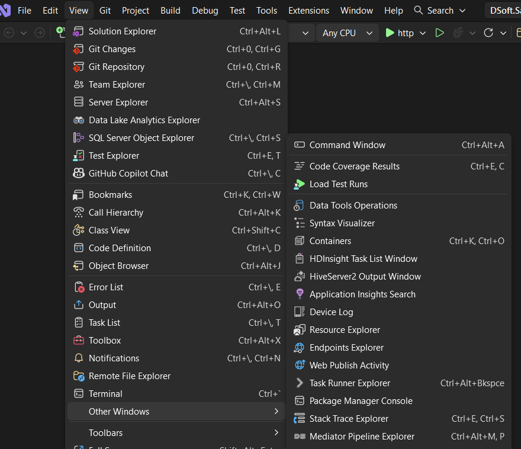
  <figcaption>Opening the explorer in Visual Studio — <strong>View → Other Windows → Mediator Pipeline Explorer</strong> (<code>Ctrl+Alt+M, P</code>).</figcaption>
</figure>

<figure class="screenshot">
  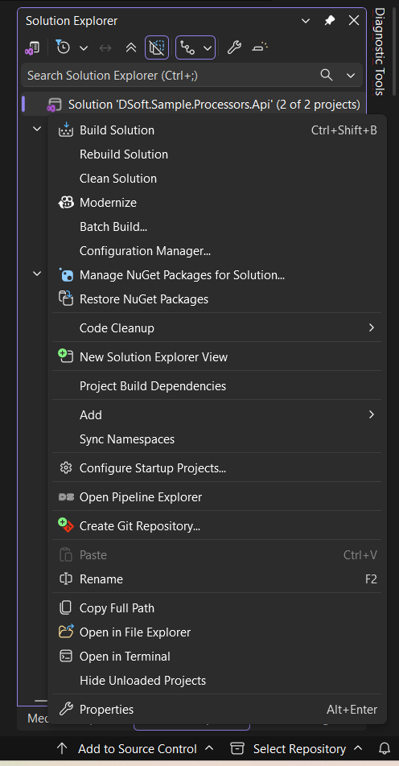
  <figcaption>…or right-click the solution in <strong>Solution Explorer → Open Pipeline Explorer</strong>.</figcaption>
</figure>

The tree populates with three sections — **Request Pipelines**, **Notifications**, and **Streams**:

<figure class="screenshot">
  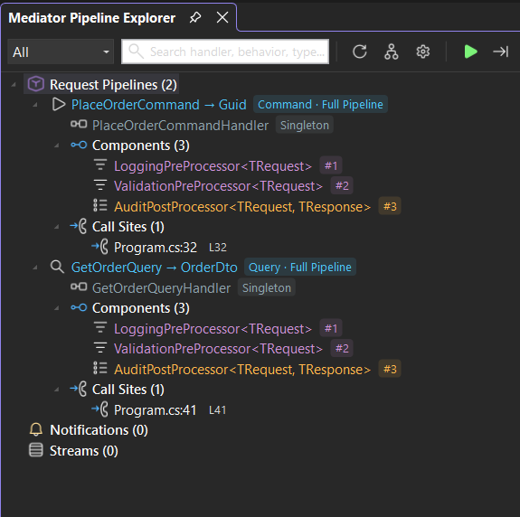
  <figcaption>The discovered tree — each request pipeline expands to its handler, behaviors, and call sites; notifications and streams get their own sections, every node tagged with its CQRS kind and pipeline mode.</figcaption>
</figure>

The badge after each request pipeline tells you two things at a glance:

- **CQRS kind** — `Command`, `Query`, or `Request` (when neither marker interface is implemented).
- **Pipeline mode** — `PassThrough` (handler only), `BehaviorsOnly`, or `Full` (pre/post-processors + behaviors).

If the tree is empty, click **Refresh** in the toolbar. If it is still empty after refresh, see [Troubleshooting: empty tree](../troubleshooting/empty-tree.md).

---

## 2. Navigate to source

Click any node in the tree. The right-hand detail panel opens with:

- The request and response types
- The handler with its DI lifetime
- Every behavior, pre-processor, and post-processor in execution order
- The call sites that dispatch this pipeline (`controller.cs:42`, `worker.cs:118`)

Click any item — handler, behavior, or call site — and the IDE jumps to the exact line. No `Ctrl+T` hunt, no manual filename guessing.

<figure class="screenshot">
  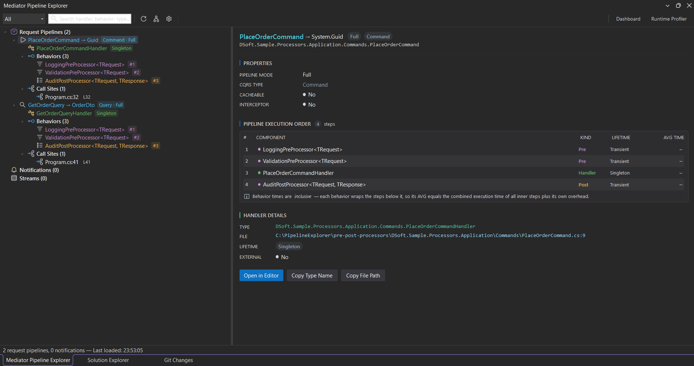
  <figcaption>The detail panel for a selected pipeline — properties (mode, CQRS type, cacheable), the numbered <strong>pipeline execution order</strong> with each step's kind, lifetime, and average time, and handler details with one-click <strong>Open in Editor</strong> / <strong>Copy Type Name</strong> / <strong>Copy File Path</strong>.</figcaption>
</figure>

The execution-order table numbers every step in the exact order it runs — pre-processors, behaviors, the handler, then post-processors. Behavior and processor times are **inclusive**: each wraps the steps below it, so its average equals the combined time of everything it surrounds plus its own overhead.

> **Tip:** right-click any node for **Go to Definition**, **Find All References**, **Copy Type Name**, and **Pin to Quick Access**.

---

## 3. Visualize the pipeline graph

The detail panel exposes a **graph** toggle (the branching icon in the toolbar) that opens the interactive graph below the detail.

- **Pan** — drag empty space.
- **Zoom** — mouse wheel.
- **Click a node** — navigates to source in the editor.
- **Detach** — pop the graph out into its own resizable window, then **Dock back** when you're done.

The graph lays out the full request flow left to right: **Send → request → pre-processors → behaviors → handler → post-processors**. It sits docked beneath the detail panel, so you can read the structure and the step list together.

<figure class="screenshot">
  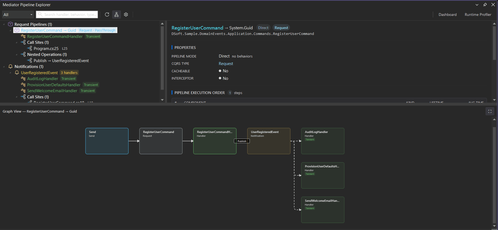
  <figcaption>The graph docked beneath the detail panel for a <code>Full</code> pipeline — <code>Send → PlaceOrderCommand → LoggingPreProcessor → ValidationPreProcessor → PlaceOrderCommandHandler → AuditPostProcessor</code> — every node click-to-source.</figcaption>
</figure>

Need more room? **Detach** the graph into its own window — handy for wide pipelines or walking your team through the flow — then **Dock back** when you're done.

<figure class="screenshot">
  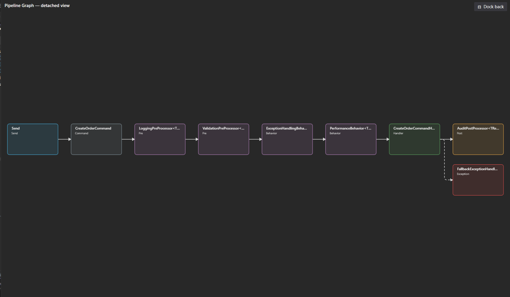
  <figcaption>The same graph detached into its own window — the full end-to-end flow with room to breathe.</figcaption>
</figure>

---

## Trace nested calls & notification fan-out

A handler rarely works alone — it often publishes a notification or dispatches another request, and that nested work is exactly what hides from an ordinary stack trace. Pipeline Explorer draws it inline.

- A **Nested Operations** node appears under any pipeline whose handler calls back into the mediator.
- **Publishing a notification** from inside a handler is drawn as a `Publish` edge that fans out to every subscribed handler.

<figure class="screenshot">
  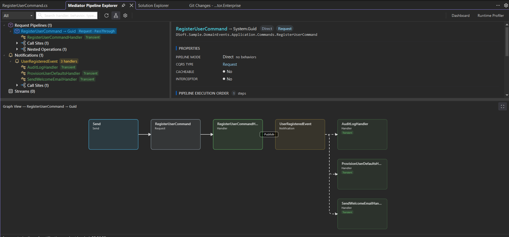
  <figcaption><code>RegisterUserCommand</code>'s handler publishes <code>UserRegisteredEvent</code> — the graph draws the <code>Publish</code> edge and the fan-out to all three subscribers, so the full chain of effects is visible from a single pipeline.</figcaption>
</figure>

---

## 4. Start runtime profiling

Profiling captures live timings as your code runs. The profiling hooks are wired into your application **automatically** by the analyzer — there is nothing to add to `Program.cs`. As long as the project that calls `services.AddMediator(...)` has the Pipeline Explorer analyzer loaded (which the extension auto-injects via `Directory.Build.props`), the hooks are emitted at compile time with zero allocation overhead until a profiling session is attached.

### Attach the profiler

- **VS Code** — Command Palette → `Mediator: Start Profiling`.
- **Visual Studio** — click **Start** (▶) in the tool window toolbar.

<figure class="screenshot">
  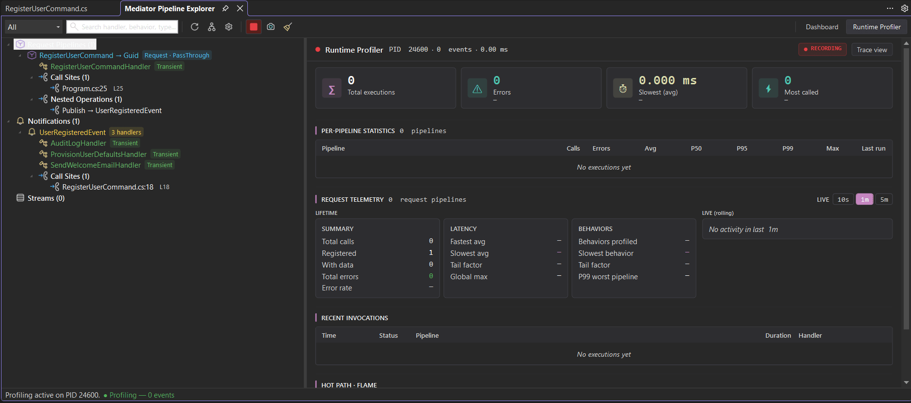
  <figcaption>The Runtime Profiler before traffic flows — the full layout is already in place (executions, errors, latency cards, per-pipeline statistics, request telemetry, recent invocations, and the Hot Path / Flame card), waiting for the first dispatch.</figcaption>
</figure>

Then issue requests against your application — run an integration test, exercise an endpoint, replay traffic. Within a second or two, the **Runtime Profiler** fills with live timings.

Each behavior is timed independently. Select a pipeline's **Behaviors** node to see every behavior's own runtime profile side by side — calls, average, self time, p50/p95/p99, and max — so you can tell which cross-cutting concern (validation, logging, transactions) is costing you. Tail-heavy handlers — those with a p99 far above the median — are flagged so you can spot bottlenecks instantly. The default threshold (`tailHeavyMinP99Ms`) prevents false positives on sub-millisecond noise.

<figure class="screenshot">
  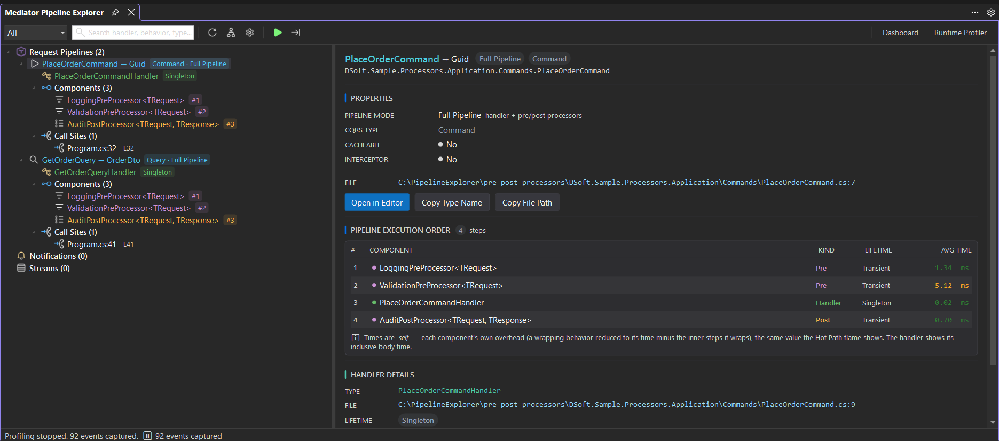
  <figcaption>The <strong>Behaviors</strong> panel — each behavior's runtime profile side by side (calls, avg, self, p50/p95/p99, max) with its kind (<code>Pre</code> / <code>Post</code>), so the costly cross-cutting concern stands out.</figcaption>
</figure>

Select a single behavior to see its type, lifetime, and source file — with one click to jump to where it's defined.

<figure class="screenshot">
  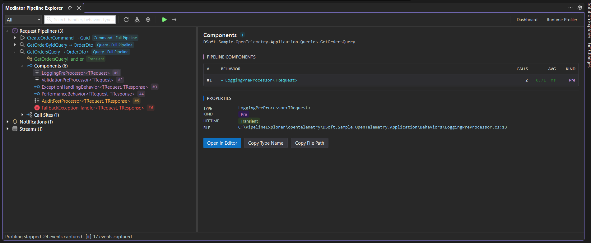
  <figcaption>Drilling into one behavior — its runtime stats plus type, kind, lifetime, and source file, with <strong>Open in Editor</strong> to jump straight to its definition.</figcaption>
</figure>

<figure class="screenshot">
  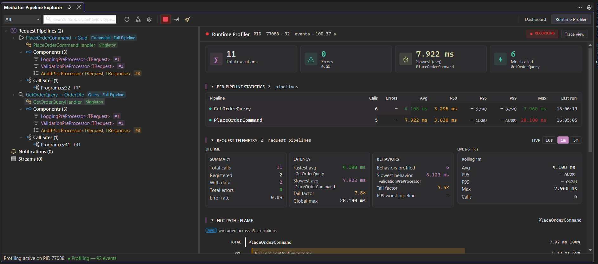
  <figcaption>The dedicated <strong>Runtime Profiler</strong> tab once traffic flows — total executions and error count up top, a per-pipeline statistics table (calls, avg, p50/p95/p99, max), request telemetry, and a live recent-invocations log.</figcaption>
</figure>

### Find the slow one

Sort the table by **p99** or **Avg** to identify the worst offender. The **Hot Path · Flame** card below the invocations log shows where the time actually goes inside a slow request — handler self vs. nested handler latency vs. notification publish overhead — with a `bottleneck` tag on whichever step dominates.

<figure class="screenshot">
  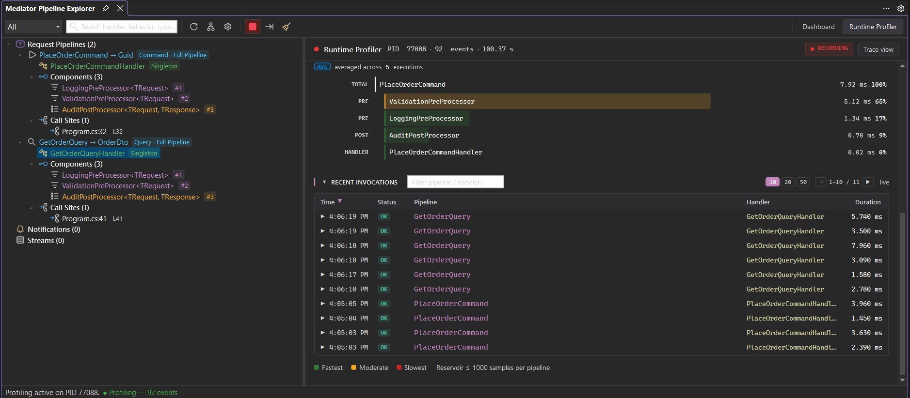
  <figcaption>The recent-invocations log with the <strong>Hot Path · Flame</strong> card below it — a per-request breakdown that surfaces which step dominates the total, aggregated across samples of the selected pipeline.</figcaption>
</figure>

Click the bottleneck row to jump to the source. Fix it, re-run, and watch the new numbers replace the old.

When you're done, click **Stop** to detach the profiler. Click **Clear** to reset the in-memory buffer, or **Snapshot** to capture the current state for later comparison.

---

## 5. Filter and search

As your codebase grows, the tree grows with it. Two tools keep it manageable:

- **Section filter** — the dropdown at the top of the toolbar narrows the tree to one of **All / Commands / Queries / Notifications / Streams**. Picking *Commands* leaves only `ICommand<>`-derived pipelines visible; *Queries* leaves only `IQuery<>`-derived ones.
- **Search box** — type any fragment of a type name, handler name, behavior name, or file path. Matches highlight and the tree collapses to the matching pipelines.

`Ctrl+F` (VS Code) or click the search box (VS) focuses the input. `Esc` clears it.

---

## What's next

You have everything you need to use Pipeline Explorer day-to-day. To go deeper, see:

- The [troubleshooting guide](../troubleshooting/index.md) — top issues and resolutions, with a diagnostic checklist.
- The runtime profiler reference (coming soon) — full p50 / p95 / p99 / max / error rate semantics.
- The settings reference (coming soon) — every toggle that controls the tree, graph, and profiler.

If something behaves unexpectedly, please file a report at the [GitHub repository](https://github.com/DSoftStudio/Mediator.Enterprise/issues) — every bug filed in Early Access becomes a fixed regression in the next release.

---

[← Back to Pipeline Explorer](../index.md)
