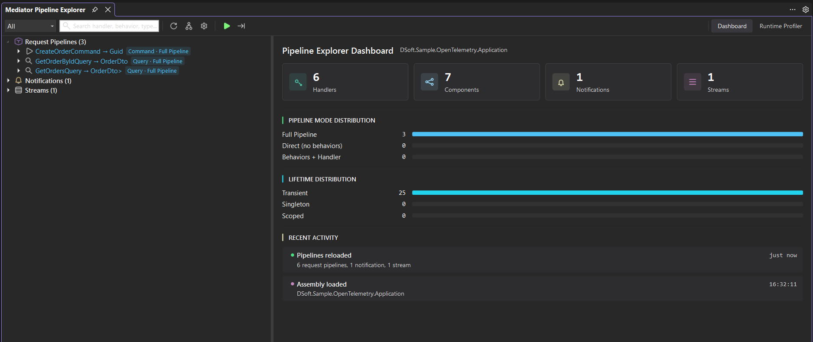
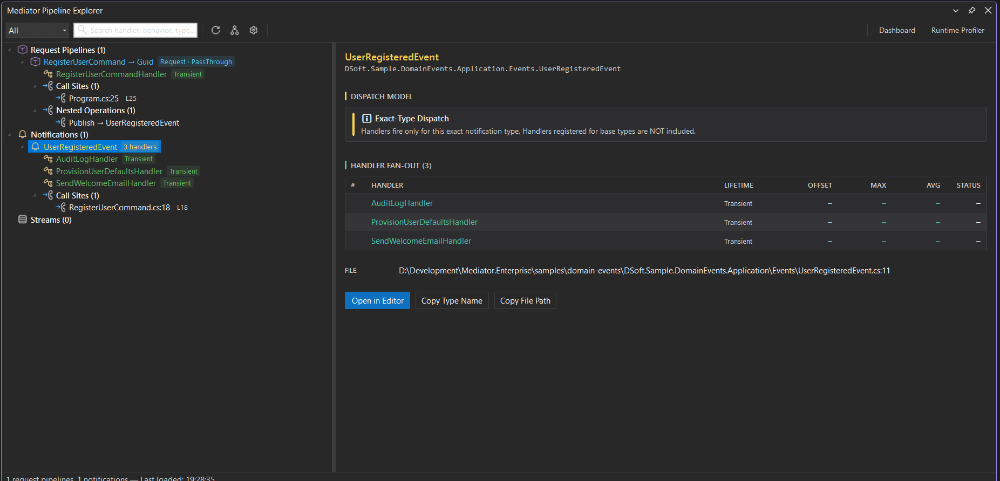

  <picture>
    <source media="(prefers-color-scheme: dark)" srcset="https://raw.githubusercontent.com/DSoftStudio/Mediator/main/assets/images/DSoftStudioBgWhite.svg">
    <source media="(prefers-color-scheme: light)" srcset="https://raw.githubusercontent.com/DSoftStudio/Mediator/main/assets/images/DSoftStudio.svg">
    
  </picture>

[← Back to Documentation](../index.md)

# Pipeline Explorer

**Architectural and runtime observability for DSoftStudio.Mediator** — directly inside Visual Studio Code and Visual Studio.

**Find bottlenecks faster. Understand mediator pipelines in minutes. Turn traces into actionable insights.**

Pipeline Explorer is a commercial IDE extension that scans your solution, discovers every `IRequestHandler`, `IStreamRequestHandler`, and `INotificationHandler`, and presents the full pipeline graph — handlers, behaviors, pre/post-processors, notification fan-out, nested mediator calls — alongside the runtime telemetry you need to make it fast.

<figure class="screenshot">
  
  <figcaption>Pipeline Explorer — the discovered pipeline tree on the left, the Dashboard on the right: live counts of handlers, components, notifications, and streams, the pipeline-mode and DI-lifetime distributions, and a recent-activity feed.</figcaption>
</figure>

---

## Why use it

Mediator-heavy applications become hard to reason about as they grow:

- **Hidden behaviors** silently wrap every dispatch — validation, logging, retry, transactions — and nobody remembers the chain.
- **Nested mediator calls** inside handlers turn a single endpoint into a dozen invocations the IDE won't show you.
- **Notification fan-out** scatters business effects across projects; tracing them needs grep and luck.
- **Performance bottlenecks** hide behind generic pipeline traces — which behavior is slow, on which request?
- **Cross-project handlers** live in `*.Application`, dispatched from `*.Api`, decorated in `*.Infrastructure` — no single source file tells the story.

Pipeline Explorer answers all of these in seconds, with one click to source.

---

## What you can do

| Capability | Outcome |
|---|---|
| **Pipeline tree explorer** | Browse request pipelines (commands & queries), notifications, and streams, with at-a-glance badges and live counts. |
| **Click-to-source navigation** | Click any node — handler, behavior, call site — and the IDE opens the file at the right line. |
| **Interactive pipeline graph** | See pre-processors → behaviors → handler → post-processors visualized per pipeline, with notification fan-out and nested calls inline. Detach it into its own window, and overlay per-node timing + health badges once profiling is on. |
| **Runtime profiler** | Live handler / behavior timings with p50 / p95 / p99 percentiles, error rates, and tail-heavy detection — plus per-pipeline statistics, request telemetry, and a Hot Path / Flame breakdown of where each request spends its time. |
| **CQRS-aware view** | Pipelines tagged automatically by `ICommand<>` / `IQuery<>` / `IRequest<>` with distinct icons and filters. |
| **Search & filters** | Find any handler, behavior, or call site by type name; filter the tree by Commands / Queries / Notifications / Streams. |

---

## Notification fan-out at a glance

Every notification you publish gets its own detail panel — a single view that maps the exact-type dispatch model, lists every subscribed handler, and (once profiling is on) reports the per-handler runtime cost so you can see which subscriber is the slow one without grepping log files.

<figure class="screenshot">
  
  <figcaption>Notification fan-out detail — the exact-type dispatch model called out (no hidden inheritance traversals), the three handlers subscribed to <code>UserRegisteredEvent</code>, and the <code>Publish</code> → fan-out graph below.</figcaption>
</figure>

---

## Get started

- [Installation](getting-started/installation.md) — Install on Visual Studio Code and Visual Studio, activate your license.
- [Quick Start](getting-started/quick-start.md) — Your first solution scan, profiling session, and source navigation.

---

## Integrations

- [OpenTelemetry bridge](opentelemetry-bridge.md) — feed the flame with enriched, source-mapped dependency spans (PostgreSQL, HTTP) from `DSoftStudio.Mediator.OpenTelemetry`, imported from a production trace or captured live.

---

## Troubleshooting

Quick answers to the issues most often hit by new users:

- [Empty pipeline tree](troubleshooting/empty-tree.md)
- [Build errors after installing](troubleshooting/analyzer-errors.md)
- [Server startup failed](troubleshooting/server-startup-failed.md)
- [Profiler not attaching](troubleshooting/profiler-not-attaching.md)
- [License activation failed](troubleshooting/activation-failed.md)

See the [full troubleshooting hub](troubleshooting/index.md) for the diagnostic checklist and full list.

---

## Available editions

Pipeline Explorer ships as two editions that share the same backend, the same data model, and the same workflow:

<!-- TODO(doc-review): confirm the extension is actually published under this Marketplace slug before release -->
- **Visual Studio Code extension** — available on the [VS Code Marketplace](https://marketplace.visualstudio.com/items?itemName=DSoftStudio.mediator-pipeline-explorer). Bundled server auto-spawns on Windows, macOS, and Linux.
- **Visual Studio extension** — available on the [Visual Studio Marketplace](https://marketplace.visualstudio.com/items?itemName=DSoftStudio.MediatorPipelineExplorer). Visual Studio 2022 17.0+ and 2026.

A single license activates both editions.

---

## Licensing

Pipeline Explorer is **commercial software**. During the launch window, a free access period lets you evaluate every commercial feature against your real codebase — no payment method required. After it ends, a subscription keeps the commercial features unlocked; either way, your code keeps compiling and running on the MIT-licensed core.

- [Pricing & plans](https://mediator.dsoftstudio.com/pricing)
- [Terms of Service](https://mediator.dsoftstudio.com/terms)
- Licensing inquiries: licensing@dsoftstudio.com

---

[← Back to Documentation](../index.md)
